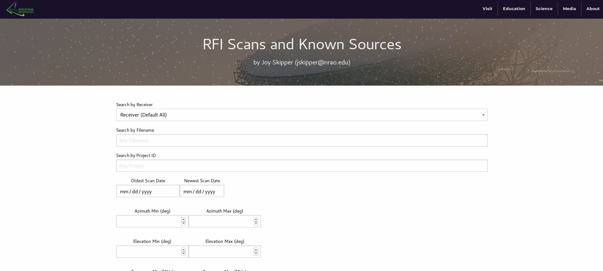
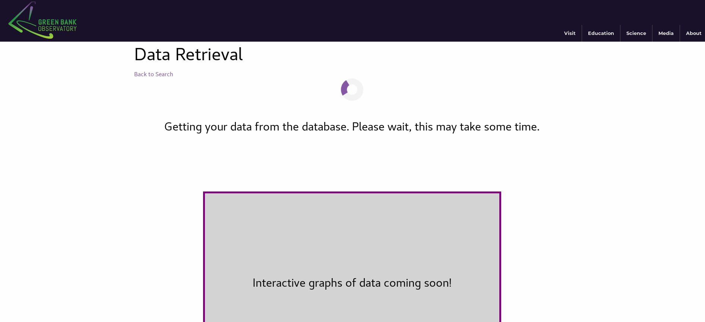
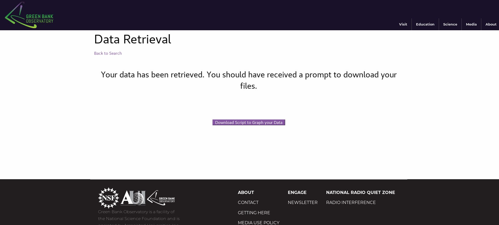

## GBT_RFI_Webpage

GBT RFI Webpage is the public-facing webpage containing access to the Green Bank Observatory Radio Frequency Interference database for the Green Bank Telescope. 

### [video demo](https://youtu.be/Fkr3nl05R9Y) of the Webpage

### Note: 

This code is still in development. There is a video demo of the prototype, which displays the general functionality, but the web page has not been published yet for general use. 

Our main concern right now is speed optimization. Additionally, we're still trying to figure out the best way to organize the folders, given the required structure of Django, in a way that still makes sense to those who are not very familiar with Django. 

### [See Documentation](docs/how_to_run.md)

